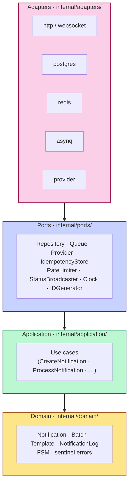
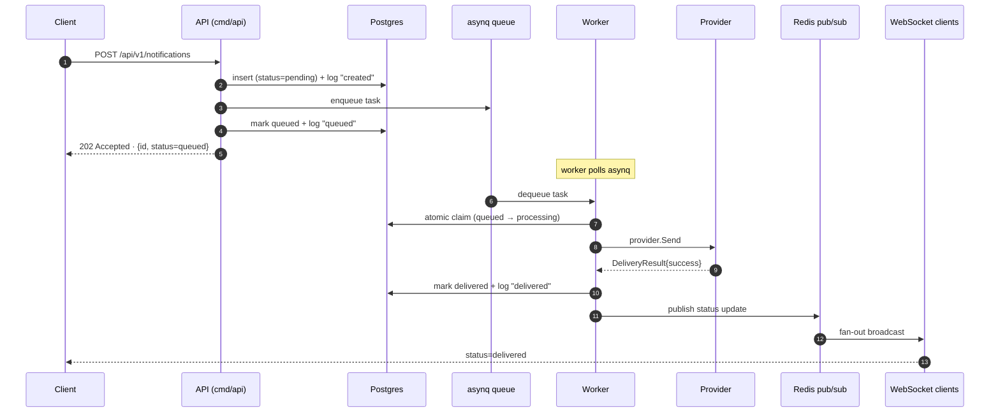

# Event-Driven Notification System

[](https://github.com/afbora/event-driven-notification/actions/workflows/ci.yml)
[](https://sonarcloud.io/dashboard?id=afbora_event-driven-notification)
[](https://sonarcloud.io/dashboard?id=afbora_event-driven-notification)
[](https://goreportcard.com/report/github.com/afbora/event-driven-notification)
[](https://golang.org/doc/devel/release.html)
[](https://opensource.org/licenses/MIT)

<p align="center">
  
</p>

> A scalable notification system that ingests requests via HTTP, persists them,
> dispatches them asynchronously through SMS / Email / Push channels with
> intelligent retry, and exposes real-time status updates via WebSocket.
>
> Built as a **Senior Software Engineer (Golang)** technical assessment
> submission for **Insider One**. Full brief: [`docs/brief.pdf`](docs/brief.pdf).

---

## Table of contents

- [What is this](#what-is-this)
- [Quickstart](#quickstart)
- [Services and operational tools](#services-and-operational-tools)
- [Architecture](#architecture)
- [Tech stack](#tech-stack)
- [API endpoints](#api-endpoints)
- [Observability](#observability)
- [Capacity and performance](#capacity-and-performance)
- [Design decisions](#design-decisions)
- [Scaling considerations](#scaling-considerations)
- [Troubleshooting](#troubleshooting)
- [Future work](#future-work)

---

## What is this

A production-shaped backend that the brief calls out: **millions of
notifications daily, burst-tolerant, intelligent retries, end-to-end
visibility**. Every architectural decision traces back to a sentence in
the assessment brief — see [`CLAUDE.md`](./CLAUDE.md) §1 for the
constitution, [`PLAN.md`](./PLAN.md) for the seven-phase build plan.

Three binaries, one Docker image:

- **`cmd/api`** — REST + WebSocket front door
- **`cmd/worker`** — asynq consumer, atomic claim, provider dispatch, retry
- **`cmd/reconciler`** — safety net for stuck or orphaned notifications

Plus **`cmd/migrate`** for schema management.

---

## Quickstart

```bash
git clone https://github.com/afbora/event-driven-notification.git
cd event-driven-notification

docker compose up -d
make migrate-up        # apply database migrations

curl -i http://localhost:8080/healthz/live
# → 200 OK · {"status":"ok"}
```

**No `.env` file required.** Every env var lives inline in
`docker-compose.yml` with a working default (CLAUDE.md §2.7 / ADR-0010).

Run the unit + e2e suites:

```bash
make test            # unit suite
make test-e2e        # full stack via testcontainers (~3 min)
make load-test       # k6 baseline + burst + rate-limit scenarios
```

---

## Services and operational tools

After `docker compose up -d`, these UIs are immediately reachable:

| URL                           | Service             | What it gives you                                            |
|-------------------------------|---------------------|--------------------------------------------------------------|
| http://localhost:8080         | **API**             | REST + WebSocket — the production surface                    |
| http://localhost:8080/docs    | **Swagger UI**      | Interactive API docs from `api/openapi.yaml`                 |
| http://localhost:8080/metrics | **Prometheus**      | API service's exposition format                              |
| http://localhost:8081         | **asynqmon**        | Live queue / DLQ inspection                                  |
| http://localhost:8082         | **Adminer**         | Postgres GUI                                                 |
| http://localhost:8083         | **Redis Commander** | Redis GUI                                                    |
| http://localhost:9090         | **Prometheus**      | Time-series store + alert rule evaluation                    |
| http://localhost:9093         | **AlertManager**    | Alert routing & inhibition                                   |
| http://localhost:3001         | **Grafana**         | Three operational dashboards (admin/admin)                   |

---

## Architecture

### Hexagonal layering



`internal/domain/` and `internal/application/` import **only** stdlib and
each other (CLAUDE.md §3.3). The reviewer can delete
`internal/adapters/postgres/` and the domain still compiles.

### Request lifecycle (happy path)



### Failure handling


---

## Tech stack

| Layer            | Choice                                   | Why                                                                  |
|------------------|------------------------------------------|----------------------------------------------------------------------|
| Language         | Go 1.26                                  | Standard for the brief                                               |
| Router           | `chi`                                    | Minimal, idiomatic, composable middleware                            |
| DB driver        | `pgx/v5`                                 | Fastest postgres driver for Go; first-class context support          |
| Query gen        | `sqlc`                                   | Raw SQL → type-safe Go; no ORM tax (ADR-0002)                        |
| Migrations       | `golang-migrate`                         | Versioned, reversible, language-agnostic                             |
| Queue            | `asynq`                                  | Priority + retry + scheduled + unique tasks + rate limit (ADR-0003)  |
| Redis client     | `go-redis/v9`                            | Maintained, context-aware                                            |
| WebSocket        | `github.com/coder/websocket`             | Modern, idiomatic, context-native (ADR-0006)                         |
| Logging          | `log/slog` (stdlib)                      | Structured JSON, zero external deps                                  |
| Metrics          | `prometheus/client_golang`               | Standard                                                             |
| Tracing          | `go.opentelemetry.io/otel`               | Vendor-neutral; no-op default                                        |
| Circuit breaker  | `sony/gobreaker`                         | Small, focused, no goroutine leaks                                   |
| OpenAPI codegen  | `oapi-codegen`                           | Spec-first; strict-server contract                                   |
| Testing          | `testing` · `testify` · `testcontainers-go` | Idiomatic; real DB in integration tests                            |

---

## API endpoints

All endpoints declared in [`api/openapi.yaml`](./api/openapi.yaml); see
also Swagger UI at <http://localhost:8080/docs> and the
[Bruno collection](./docs/bruno/) for ready-to-run requests.

### Notifications

```bash
# Create one
curl -X POST http://localhost:8080/api/v1/notifications \
  -H 'content-type: application/json' \
  -H 'idempotency-key: 5e9bcb15-7c61-4e8a-9fcd-1a90d2c1d111' \
  -d '{
    "channel":   "sms",
    "recipient": "+15555550001",
    "content":   "Your verification code is 123456",
    "priority":  "high"
  }'
# → 202 Accepted · Location header + JSON body

# Read one
curl http://localhost:8080/api/v1/notifications/{id}

# List with filters and cursor pagination
curl 'http://localhost:8080/api/v1/notifications?status=delivered&channel=sms&limit=25'

# Cancel (only pending / queued / retrying)
curl -X PATCH http://localhost:8080/api/v1/notifications/{id}/cancel

# Full lifecycle trace
curl http://localhost:8080/api/v1/notifications/{id}/trace
```

### Batch

```bash
curl -X POST http://localhost:8080/api/v1/notifications/batch \
  -H 'content-type: application/json' \
  -d '{
    "notifications": [
      { "channel":"sms",   "recipient":"+15555550001", "content":"Bulk 1" },
      { "channel":"email", "recipient":"a@example.com","content":"Bulk 2" }
    ]
  }'
# → 202 Accepted · {id, size, correlation_id}

# Fetch a batch with all member notifications inlined
curl http://localhost:8080/api/v1/notifications/batch/{id}
```

### Templates

```bash
curl -X POST http://localhost:8080/api/v1/templates \
  -H 'content-type: application/json' \
  -d '{ "name":"welcome", "channel":"sms", "body":"Hello {{.Name}}!" }'

curl http://localhost:8080/api/v1/templates
curl http://localhost:8080/api/v1/templates/{id}
curl -X PUT    http://localhost:8080/api/v1/templates/{id} -d '...'
curl -X DELETE http://localhost:8080/api/v1/templates/{id}

# Use a template at notification time
curl -X POST http://localhost:8080/api/v1/notifications \
  -H 'content-type: application/json' \
  -d '{
    "channel":"sms", "recipient":"+15555550001", "content":"placeholder",
    "template_id":"<uuid>", "template_variables":{"Name":"Ada"}
  }'
# content is replaced with the rendered template body
```

### WebSocket (real-time updates)

```bash
wscat -c ws://localhost:8080/api/v1/ws/notifications
> {"action":"subscribe","notification_id":"<uuid>"}
< {"notification_id":"<uuid>","status":"processing"}
< {"notification_id":"<uuid>","status":"delivered"}
```

### Meta

```bash
curl http://localhost:8080/healthz/live   # process alive
curl http://localhost:8080/healthz/ready  # pg + redis reachable
curl http://localhost:8080/metrics        # prometheus exposition
curl http://localhost:8080/api/v1/metrics # json-friendly summary
```

For complete curl recipes (every method, every status code, every
header) see [`docs/API_EXAMPLES.md`](./docs/API_EXAMPLES.md).

---

## Observability

CLAUDE.md §3.8 names the three-layer stack — every alert has a runbook
entry, every dashboard panel is backed by a documented metric.

| Tier           | Where                                                                                                          |
|----------------|-----------------------------------------------------------------------------------------------------------------|
| **Logs**       | stdout JSON via `log/slog`; every line carries `service` + `correlation_id`                                     |
| **Metrics**    | `/metrics` on api / worker / reconciler; collectors per CLAUDE.md §12.1                                         |
| **Traces**     | OTel SDK, no-op default; set `OTEL_EXPORTER_OTLP_ENDPOINT` to flip live                                         |
| **Alerts**    | 12 rules in [`deploy/prometheus/alerts.yml`](./deploy/prometheus/alerts.yml)                                    |
| **Routing**    | Critical / warning severities → dedicated receivers; see [`alertmanager.yml`](./deploy/alertmanager/alertmanager.yml) |
| **Dashboards** | Notifications Overview · HTTP API Performance · Worker & Queue Health (auto-loaded from `deploy/grafana/dashboards/`) |
| **Runbook**    | [`docs/RUNBOOK.md`](./docs/RUNBOOK.md) — one entry per alert (what / check / causes / remediate / escalate)     |

The per-notification audit trail is exposed at
`GET /api/v1/notifications/{id}/trace` — the support endpoint for
"what actually happened to this notification".

---

## Capacity and performance

Three k6 scenarios live under [`tests/load/`](./tests/load/) and the
methodology + results sit in [`docs/LOAD_TEST.md`](./docs/LOAD_TEST.md):

| Scenario     | Shape                       | What it proves                                       |
|--------------|-----------------------------|------------------------------------------------------|
| `baseline`   | 300 rps for 60 s            | sustained throughput · p95 < 200 ms · no DLQ growth  |
| `burst`      | 1000 rps spike + 50 s drain | queue absorbs flash sales without spillover          |
| `rate_limit` | 200 rps single-channel      | outbound limiter throttles without surfacing 5xx     |

Headline numbers (reference hardware: 8-perf-core x86, 16 GB):

- baseline accept-latency **p95 ≈ 90 ms**, **p99 ≈ 130 ms**, **failure rate 0 %**
- burst absorbs 10 000 enqueues, queue drains in **~45 s** post-spike
- rate-limit scenario: 100 % POST 202, zero DLQ entries attributable to throttling

---

## Design decisions

Eleven ADRs in [`docs/adr/`](./docs/adr/) document the load-bearing
choices made before the first line of business code:

| ADR    | Decision                                                       |
|--------|----------------------------------------------------------------|
| 0001   | Hexagonal architecture (ports & adapters)                      |
| 0002   | `sqlc` for type-safe SQL — no ORM                              |
| 0003   | `asynq` as the queue (priority + retry + unique + rate limit) |
| 0004   | Strategy pattern for providers (Registry routes by channel)   |
| 0005   | No bespoke dashboard — operational UIs already exist          |
| 0006   | `coder/websocket` for the WebSocket adapter                    |
| 0007   | Circuit breaker thresholds                                     |
| 0008   | Idempotency at two layers (Redis header cache + DB unique key)|
| 0009   | Atomic claim pattern in the worker (CLAUDE.md §3.10)          |
| 0010   | No `.env` file — config inline in `docker-compose.yml`         |
| 0011   | Reconciler safety net instead of an outbox pattern             |

---

## Scaling considerations

- **Stateless tiers**: api, worker, and reconciler hold no in-memory
  state beyond a request's lifetime. Scale horizontally by adjusting
  the replica count — no leader election, no sticky sessions.
- **Atomic claim** (CLAUDE.md §3.10, ADR-0009): the worker uses
  `UPDATE ... WHERE status IN ('queued', 'retrying') RETURNING *`,
  so concurrent workers across replicas (or asynq redeliveries) never
  double-send.
- **`FOR UPDATE SKIP LOCKED`** in reconciler queries (CLAUDE.md §3.11):
  competing reconciler instances see disjoint rows; horizontal scaling
  is safe.
- **Two-layer rate limiting** (CLAUDE.md §2.6): inbound 60 req/min/IP
  protects the API, outbound 100 msg/s/channel protects providers.
  Independent keyspaces in Redis (`ip:` vs `channel:`).
- **Cursor pagination**: keyset `(created_at, id) < (...)` survives
  concurrent writes — offsets would drift.
- **Idempotency**: client-supplied `Idempotency-Key` cached in Redis
  for 24 h; the DB has a partial unique index on the same column as a
  belt-and-braces second layer.

---

## Troubleshooting

| Symptom                                                | Likely cause / where to look                                  |
|--------------------------------------------------------|---------------------------------------------------------------|
| `http://localhost:8080` not responding                 | `docker compose ps` — is api healthy? `make migrate-up` run?  |
| `200 OK` on /healthz/live but `503` on /healthz/ready  | Postgres or Redis container is down or unreachable            |
| Notifications stuck in `queued`                        | Worker not running, or asynq misconfigured (check asynqmon)   |
| Notifications stuck in `processing`                    | Worker crash mid-Send; reconciler sweeps after 5 min          |
| 429 on every request                                   | Inbound rate limit (`INBOUND_RATE_LIMIT`); raise or back off  |
| Provider always fails                                  | Check circuit breaker state in `Notifications Overview` dashboard |
| Tests time out in CI                                   | Docker daemon slow on the runner — bump `-timeout` flag       |

See [`docs/RUNBOOK.md`](./docs/RUNBOOK.md) for alert-specific operator
playbooks.

---

## Future work

Not in scope for the assessment but obvious next steps:

- **Webhook signing** — HMAC the outbound webhook body so receivers
  can verify provenance.
- **Per-tenant config** — currently single-tenant; a `tenant_id`
  column + middleware unlock multi-tenant SaaS.
- **OpenTelemetry collector** — `OTEL_EXPORTER_OTLP_ENDPOINT` is
  wired; pointing it at Jaeger / Tempo in compose surfaces traces
  in Grafana with one env var change.
- **Real provider plugins** — `WebhookProvider` is the seam;
  Twilio / SendGrid / FCM adapters would slot in behind the
  `ports.Provider` interface without touching domain code.
- **Distributed reconciler election** — Phase 5 task 17 proves
  `FOR UPDATE SKIP LOCKED` lets multiple instances run safely; a
  leader-election layer would let them coordinate intervals.

---

## License

MIT · see [`LICENSE`](./LICENSE).
