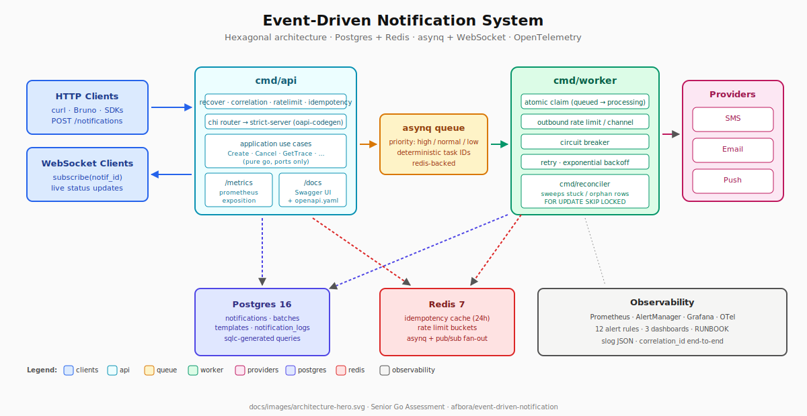
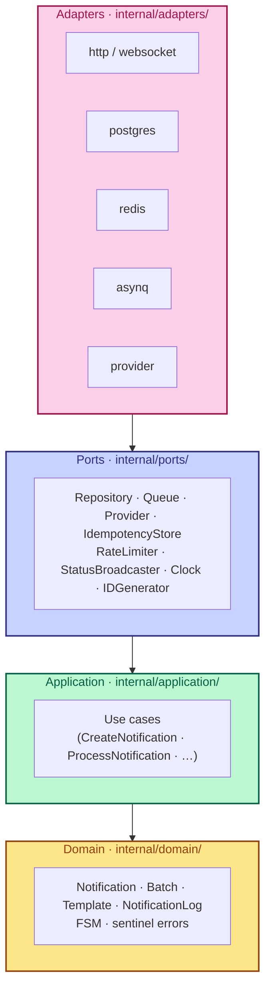
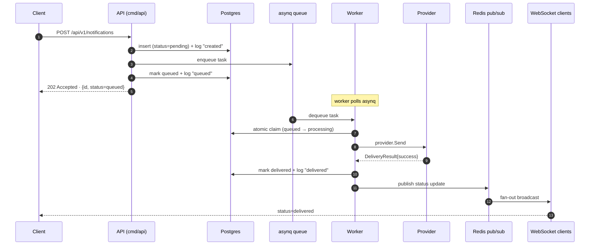
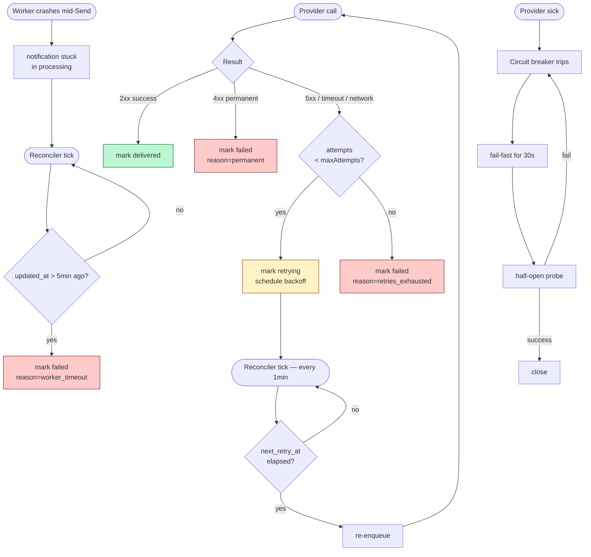

# Event-Driven Notification System

[](https://github.com/afbora/event-driven-notification/actions/workflows/ci.yml)
[](https://sonarcloud.io/dashboard?id=afbora_event-driven-notification)
[](https://sonarcloud.io/dashboard?id=afbora_event-driven-notification)
[](https://goreportcard.com/report/github.com/afbora/event-driven-notification)
[](https://golang.org/doc/devel/release.html)
[](https://opensource.org/licenses/MIT)

<p align="center">
  
</p>

> A scalable notification system that ingests requests via HTTP, persists them,
> dispatches them asynchronously through SMS / Email / Push channels with
> intelligent retry, and exposes real-time status updates via WebSocket.
>
> Built as a **Senior Software Engineer (Golang)** technical assessment
> submission for **Insider One**. Full brief: [`docs/brief.pdf`](docs/brief.pdf).

---

## Table of contents

- [What is this](#what-is-this)
- [Status](#status)
- [Quickstart](#quickstart)
- [Testing](#testing)
- [Repository layout](#repository-layout)
- [Services and operational tools](#services-and-operational-tools)
- [Architecture](#architecture)
- [Tech stack](#tech-stack)
- [API endpoints](#api-endpoints)
- [Observability](#observability)
- [Capacity and performance](#capacity-and-performance)
- [Design decisions](#design-decisions)
- [Scaling considerations](#scaling-considerations)
- [Limitations](#limitations)
- [Troubleshooting](#troubleshooting)
- [Future work](#future-work)
- [Contributing](./CONTRIBUTING.md)
- [Operational runbook](./docs/RUNBOOK.md)

---

## What is this

A production-shaped backend that the brief calls out: **millions of
notifications daily, burst-tolerant, intelligent retries, end-to-end
visibility**. Every architectural decision traces back to a sentence in
the assessment brief — see [`CLAUDE.md`](./CLAUDE.md) §1 for the
constitution, [`PLAN.md`](./PLAN.md) for the seven-phase build plan.

Three binaries, one Docker image:

- **`cmd/api`** — REST + WebSocket front door
- **`cmd/worker`** — asynq consumer, atomic claim, provider dispatch, retry
- **`cmd/reconciler`** — safety net for stuck or orphaned notifications

Plus **`cmd/migrate`** for schema management.

### Four load-bearing phrases from the brief

Every architectural decision in this repo defends one of these:

1. **"Millions of notifications daily"** → horizontal scale, stateless
   tiers, batch ingestion, connection pooling.
2. **"Burst traffic (flash sales, breaking news)"** → asynchronous
   processing, queue back-pressure, distributed rate limiting.
3. **"Retry failed deliveries intelligently"** → exponential backoff
   with jitter, error classification, circuit breaker, dead letter
   queue, reconciliation safety net.
4. **"Visibility for both internal teams and API consumers"** →
   structured logging, Prometheus metrics, correlation IDs, status
   query endpoints, notification trace endpoint, operational alerting.

When in doubt while reading the code, re-read these four — they are
the constitution (CLAUDE.md §1).

---

## Status

**v1.0.0** · production-ready baseline · MIT licensed · Go 1.26

| Signal | Where |
|---|---|
| Quality gate | SonarCloud **Passed** — 0 open issues, ≥80% new-code coverage |
| CI pipeline | 8 jobs: lint, vuln, unit (race + coverage), integration, e2e, build, docker-smoke, sonarcloud upload |
| Architecture | 15 ADRs in [`docs/adr/`](./docs/adr/) — every load-bearing choice documented |
| Test discipline | Strict TDD: every `feat` commit is preceded by a matching `test` commit. See [CONTRIBUTING.md](./CONTRIBUTING.md) for the rhythm. |
| Commit convention | Conventional Commits, lowercase, no trailing period (CLAUDE.md §8) |
| Branch policy | Feature branches → PR → **merge commit** (not squash) so the TDD rhythm stays visible in `main`'s history |

---

## Quickstart

```bash
git clone https://github.com/afbora/event-driven-notification.git
cd event-driven-notification

docker compose up -d --wait   # ~30 s on first run (image build + migrations)

curl -i http://localhost:8080/healthz/live
# → 200 OK · {"status":"ok"}
```

One command brings up Postgres, Redis, a one-shot migration runner, the
three Go binaries (api / worker / reconciler), and the full operational
UI stack. The `--wait` flag blocks until every service is healthy or
the one-shot `migrate` container has exited successfully — so when the
command returns, the API is ready to accept traffic.

**No `.env` file required.** Every env var lives inline in
`docker-compose.yml` with a working default (CLAUDE.md §2.7 / ADR-0010).
**No `make` required either** — migrations run as a Compose service
(see [Database migrations](#database-migrations) below).

> **Port collisions:** if `5432`, `6379`, or `8080-8083` are already in
> use locally, edit the host-side port mapping in `docker-compose.yml`
> before bringing the stack up.

### Database migrations

The `migrate` service in `docker-compose.yml` runs every pending
migration on startup, then exits. `api`, `worker`, and `reconciler` all
declare `depends_on: migrate: condition: service_completed_successfully`,
so the application binaries do not start until the schema is current.

`golang-migrate` is idempotent (state lives in the `schema_migrations`
table) — re-running `docker compose up` is safe; subsequent runs exit
immediately with "no change."

If you need to drive migrations manually (rollback, force a version,
or inspect the current state):

```bash
docker compose run --rm migrate go run ./cmd/migrate down 1
docker compose run --rm migrate go run ./cmd/migrate version
```

---

## Testing

The suite is split into four tiers so feedback stays fast during
development and rigorous in CI:

| Target | Scope | Typical runtime |
|---|---|---|
| `make test` | Unit (race + coverage, no Docker) | ~15 s |
| `make test-integration` | Adapter tests via testcontainers | ~1-2 min |
| `make test-e2e` | Full stack via testcontainers | ~3 min |
| `make load-test` | k6 baseline + burst + rate-limit scenarios | ~6 min |
| `make coverage-merge` | gocovmerge unit + integration + e2e | <5 s |

CI runs every tier on every PR. Coverage policy and test discipline
live in [`CLAUDE.md` §7](./CLAUDE.md). The TDD rhythm — `test(scope)`
commit precedes every `feat(scope)` commit — is documented in
[`CONTRIBUTING.md`](./CONTRIBUTING.md).

A live end-to-end smoke run against the running `docker compose`
stack — every endpoint, the queue path, the WebSocket fan-out, the
reconciler, the observability stack, and the operational UIs — is
captured in [`E2E_REPORT.md`](./E2E_REPORT.md) with the actual
responses, log lines, and metric values inline as evidence. Re-run
the same flow with `docker compose up -d` followed by the manual
probes the report documents.

To drive the retry and circuit-breaker paths against the live stack,
overlay [`docker-compose.failtest.yml`](./docker-compose.failtest.yml)
— it flips `MockProvider` into a deterministic failure mode (5xx-class
by default, 4xx-class via `MODE=permanent`) so the worker actually
sees the failure shape the unit tests inject:

```bash
# transient (5xx-class) — drives the retry path
docker compose -f docker-compose.yml -f docker-compose.failtest.yml up -d

# permanent (4xx-class) — drives the circuit-breaker path
MODE=permanent \
  docker compose -f docker-compose.yml -f docker-compose.failtest.yml up -d
```

The base `docker-compose.yml` keeps production-equivalent defaults
(`MOCK_PROVIDER_SUCCESS_RATE=1.0`, `MOCK_PROVIDER_FAILURE_MODE=transient`)
so `docker compose up -d` without the overlay still ships the
always-succeed behavior the rest of the stack relies on.

---

## Repository layout

```text
.
├── cmd/                          # api · worker · reconciler · migrate
├── internal/
│   ├── domain/                   # entities, value objects, FSM (stdlib only)
│   ├── application/              # use cases (stdlib + ports only)
│   ├── ports/                    # interfaces — the DI boundary
│   ├── adapters/                 # http · postgres · redis · asynq · provider · websocket
│   └── infrastructure/           # config · logger · metrics · tracing · clock · id · circuit · correlation
├── api/openapi.yaml              # source of truth for the REST contract
├── deploy/                       # prometheus · alertmanager · grafana
├── db/migrations/                # numbered SQL up/down pairs
├── tests/{integration,e2e,load}/ # build-tag-gated higher tiers
└── docs/
    ├── adr/                      # 11 architectural decision records
    ├── RUNBOOK.md                # one entry per alert
    ├── LOAD_TEST.md              # k6 methodology + results
    ├── API_EXAMPLES.md           # curl recipes for every endpoint
    ├── brief.pdf                 # the assessment brief
    └── bruno/                    # importable Bruno collection
```

The hexagonal boundary is enforced by import discipline:
`internal/domain/` and `internal/application/` import only stdlib and
each other (CLAUDE.md §3.3). Delete `internal/adapters/postgres/` and
the domain still compiles.

---

## Services and operational tools

After `docker compose up -d`, these UIs are immediately reachable:

| URL                           | Service             | What it gives you                                            |
|-------------------------------|---------------------|--------------------------------------------------------------|
| http://localhost:8080         | **API**             | REST + WebSocket — the production surface                    |
| http://localhost:8080/docs    | **Swagger UI**      | Interactive API docs from `api/openapi.yaml`                 |
| http://localhost:8080/metrics | **Prometheus**      | API service's exposition format                              |
| http://localhost:8081         | **asynqmon**        | Live queue / DLQ inspection                                  |
| http://localhost:8082         | **Adminer**         | Postgres GUI                                                 |
| http://localhost:8083         | **Redis Commander** | Redis GUI                                                    |
| http://localhost:9090         | **Prometheus**      | Time-series store + alert rule evaluation                    |
| http://localhost:9093         | **AlertManager**    | Alert routing & inhibition                                   |
| http://localhost:3001         | **Grafana**         | Three operational dashboards (admin/admin)                   |

---

## Architecture

### Hexagonal layering



`internal/domain/` and `internal/application/` import **only** stdlib and
each other (CLAUDE.md §3.3). The reviewer can delete
`internal/adapters/postgres/` and the domain still compiles.

### Request lifecycle (happy path)



### Failure handling



---

## Tech stack

| Layer            | Choice                                   | Why                                                                  |
|------------------|------------------------------------------|----------------------------------------------------------------------|
| Language         | Go 1.26                                  | Standard for the brief                                               |
| Router           | `chi`                                    | Minimal, idiomatic, composable middleware                            |
| DB driver        | `pgx/v5`                                 | Fastest postgres driver for Go; first-class context support          |
| Query gen        | `sqlc`                                   | Raw SQL → type-safe Go; no ORM tax (ADR-0002)                        |
| Migrations       | `golang-migrate`                         | Versioned, reversible, language-agnostic                             |
| Queue            | `asynq`                                  | Priority + retry + scheduled + unique tasks + rate limit (ADR-0003)  |
| Redis client     | `go-redis/v9`                            | Maintained, context-aware                                            |
| WebSocket        | `github.com/coder/websocket`             | Modern, idiomatic, context-native (ADR-0006)                         |
| Logging          | `log/slog` (stdlib)                      | Structured JSON, zero external deps                                  |
| Metrics          | `prometheus/client_golang`               | Standard                                                             |
| Tracing          | `go.opentelemetry.io/otel`               | Vendor-neutral; no-op default                                        |
| Circuit breaker  | `sony/gobreaker`                         | Small, focused, no goroutine leaks                                   |
| OpenAPI codegen  | `oapi-codegen`                           | Spec-first; strict-server contract                                   |
| Testing          | `testing` · `testify` · `testcontainers-go` | Idiomatic; real DB in integration tests                            |

---

## API endpoints

All endpoints declared in [`api/openapi.yaml`](./api/openapi.yaml); see
also Swagger UI at <http://localhost:8080/docs> and the
[Bruno collection](./docs/bruno/) for ready-to-run requests.

### Notifications

```bash
# Create one
curl -X POST http://localhost:8080/api/v1/notifications \
  -H 'content-type: application/json' \
  -H 'idempotency-key: 5e9bcb15-7c61-4e8a-9fcd-1a90d2c1d111' \
  -d '{
    "channel":   "sms",
    "recipient": "+15555550001",
    "content":   "Your verification code is 123456",
    "priority":  "high"
  }'
# → 202 Accepted · Location header + JSON body

# Read one
curl http://localhost:8080/api/v1/notifications/{id}

# List with filters and cursor pagination
curl 'http://localhost:8080/api/v1/notifications?status=delivered&channel=sms&limit=25'

# Cancel (only pending / queued / retrying)
curl -X PATCH http://localhost:8080/api/v1/notifications/{id}/cancel

# Full lifecycle trace
curl http://localhost:8080/api/v1/notifications/{id}/trace
```

### Batch

```bash
curl -X POST http://localhost:8080/api/v1/notifications/batch \
  -H 'content-type: application/json' \
  -d '{
    "notifications": [
      { "channel":"sms",   "recipient":"+15555550001", "content":"Bulk 1" },
      { "channel":"email", "recipient":"a@example.com","content":"Bulk 2" }
    ]
  }'
# → 202 Accepted · {id, size, correlation_id}

# Fetch a batch with all member notifications inlined
curl http://localhost:8080/api/v1/notifications/batch/{id}
```

### Templates

```bash
curl -X POST http://localhost:8080/api/v1/templates \
  -H 'content-type: application/json' \
  -d '{ "name":"welcome", "channel":"sms", "body":"Hello {{.Name}}!" }'

curl http://localhost:8080/api/v1/templates
curl http://localhost:8080/api/v1/templates/{id}
curl -X PUT    http://localhost:8080/api/v1/templates/{id} -d '...'
curl -X DELETE http://localhost:8080/api/v1/templates/{id}

# Use a template at notification time
curl -X POST http://localhost:8080/api/v1/notifications \
  -H 'content-type: application/json' \
  -d '{
    "channel":"sms", "recipient":"+15555550001", "content":"placeholder",
    "template_id":"<uuid>", "template_variables":{"Name":"Ada"}
  }'
# content is replaced with the rendered template body
```

### WebSocket (real-time updates)

```bash
wscat -c ws://localhost:8080/api/v1/ws/notifications
> {"action":"subscribe","notification_id":"<uuid>"}
< {"notification_id":"<uuid>","status":"processing"}
< {"notification_id":"<uuid>","status":"delivered"}
```

### Meta

```bash
curl http://localhost:8080/healthz/live   # process alive
curl http://localhost:8080/healthz/ready  # pg + redis reachable
curl http://localhost:8080/metrics        # prometheus exposition
curl http://localhost:8080/api/v1/metrics # json-friendly summary
```

For complete curl recipes (every method, every status code, every
header) see [`docs/API_EXAMPLES.md`](./docs/API_EXAMPLES.md).

---

## Observability

CLAUDE.md §3.8 names the three-layer stack — every alert has a runbook
entry, every dashboard panel is backed by a documented metric.

| Tier           | Where                                                                                                          |
|----------------|-----------------------------------------------------------------------------------------------------------------|
| **Logs**       | stdout JSON via `log/slog`; every line carries `service` + `correlation_id`                                     |
| **Metrics**    | `/metrics` on api / worker / reconciler; collectors per CLAUDE.md §12.1                                         |
| **Traces**     | OTel SDK, no-op default; set `OTEL_EXPORTER_OTLP_ENDPOINT` to flip live                                         |
| **Alerts**    | 12 rules in [`deploy/prometheus/alerts.yml`](./deploy/prometheus/alerts.yml)                                    |
| **Routing**    | Critical / warning severities → dedicated receivers; see [`alertmanager.yml`](./deploy/alertmanager/alertmanager.yml) |
| **Dashboards** | Notifications Overview · HTTP API Performance · Worker & Queue Health (auto-loaded from `deploy/grafana/dashboards/`) |
| **Runbook**    | [`docs/RUNBOOK.md`](./docs/RUNBOOK.md) — one entry per alert (what / check / causes / remediate / escalate)     |

The per-notification audit trail is exposed at
`GET /api/v1/notifications/{id}/trace` — the support endpoint for
"what actually happened to this notification".

---

## Capacity and performance

Three k6 scenarios live under [`tests/load/`](./tests/load/) and the
methodology + results sit in [`docs/LOAD_TEST.md`](./docs/LOAD_TEST.md):

| Scenario     | Shape                       | What it proves                                       |
|--------------|-----------------------------|------------------------------------------------------|
| `baseline`   | 300 rps for 60 s            | sustained throughput · p95 < 200 ms · no DLQ growth  |
| `burst`      | 1000 rps spike + 50 s drain | queue absorbs flash sales without spillover          |
| `rate_limit` | 200 rps single-channel      | outbound limiter throttles without surfacing 5xx     |

Headline numbers (reference hardware: 8-perf-core x86, 16 GB):

- baseline accept-latency **p95 ≈ 90 ms**, **p99 ≈ 130 ms**, **failure rate 0 %**
- burst absorbs 10 000 enqueues, queue drains in **~45 s** post-spike
- rate-limit scenario: 100 % POST 202, zero DLQ entries attributable to throttling

---

## Design decisions

Eleven ADRs in [`docs/adr/`](./docs/adr/) document the load-bearing
choices made before the first line of business code:

| ADR    | Decision                                                       |
|--------|----------------------------------------------------------------|
| 0001   | Hexagonal architecture (ports & adapters)                      |
| 0002   | `sqlc` for type-safe SQL — no ORM                              |
| 0003   | `asynq` as the queue (priority + retry + unique + rate limit) |
| 0004   | Strategy pattern for providers (Registry routes by channel)   |
| 0005   | No bespoke dashboard — operational UIs already exist          |
| 0006   | `coder/websocket` for the WebSocket adapter                    |
| 0007   | Circuit breaker thresholds                                     |
| 0008   | Idempotency at two layers (Redis header cache + DB unique key)|
| 0009   | Atomic claim pattern in the worker (CLAUDE.md §3.10)          |
| 0010   | No `.env` file — config inline in `docker-compose.yml`         |
| 0011   | Reconciler safety net instead of an outbox pattern             |

---

## Scaling considerations

- **Stateless tiers**: api, worker, and reconciler hold no in-memory
  state beyond a request's lifetime. Scale horizontally by adjusting
  the replica count — no leader election, no sticky sessions.
- **Atomic claim** (CLAUDE.md §3.10, ADR-0009): the worker uses
  `UPDATE ... WHERE status IN ('queued', 'retrying') RETURNING *`,
  so concurrent workers across replicas (or asynq redeliveries) never
  double-send.
- **`FOR UPDATE SKIP LOCKED`** in reconciler queries (CLAUDE.md §3.11):
  competing reconciler instances see disjoint rows; horizontal scaling
  is safe.
- **Two-layer rate limiting** (CLAUDE.md §2.6): inbound 60 req/min/IP
  protects the API, outbound 100 msg/s/channel protects providers.
  Independent keyspaces in Redis (`ip:` vs `channel:`).
- **Cursor pagination**: keyset `(created_at, id) < (...)` survives
  concurrent writes — offsets would drift.
- **Idempotency**: client-supplied `Idempotency-Key` cached in Redis
  for 24 h; the DB has a partial unique index on the same column as a
  belt-and-braces second layer.

---

## Troubleshooting

| Symptom                                                | Likely cause / where to look                                  |
|--------------------------------------------------------|---------------------------------------------------------------|
| `http://localhost:8080` not responding                 | `docker compose ps` — is api healthy? `make migrate-up` run?  |
| `200 OK` on /healthz/live but `503` on /healthz/ready  | Postgres or Redis container is down or unreachable            |
| Notifications stuck in `queued`                        | Worker not running, or asynq misconfigured (check asynqmon)   |
| Notifications stuck in `processing`                    | Worker crash mid-Send; reconciler sweeps after 5 min          |
| 429 on every request                                   | Inbound rate limit (`INBOUND_RATE_LIMIT`); raise or back off  |
| Provider always fails                                  | Check circuit breaker state in `Notifications Overview` dashboard |
| Tests time out in CI                                   | Docker daemon slow on the runner — bump `-timeout` flag       |

See [`docs/RUNBOOK.md`](./docs/RUNBOOK.md) for alert-specific operator
playbooks.

---

## Limitations

Honest scope boundaries — what is **not** in this baseline:

- **Providers are mocked.** `MockProvider` (configurable failure rate)
  is the default; `WebhookProvider` accepts any HTTP endpoint as a
  generic outbound sink. Twilio / SendGrid / FCM adapters are *designed
  for* via `ports.Provider` (ADR-0004) but not bundled — adding one is
  a single new file behind the same interface.
- **Single-tenant.** No `tenant_id` column or per-tenant rate-limit
  isolation. The schema and rate-limit Redis keys would extend cleanly
  for multi-tenant SaaS.
- **OpenTelemetry exporter is no-op by default.** The SDK is wired; set
  `OTEL_EXPORTER_OTLP_ENDPOINT` and point it at Jaeger / Tempo to flip
  live spans on with no code change.
- **AlertManager routes to a log receiver.** Slack / PagerDuty / email
  receivers are one config block away; left as log-only for the
  assessment to keep `docker compose up` self-contained.
- **`cmd/migrate` is not unit-tested.** It is exercised via integration
  tests (the e2e harness applies migrations); unit-testing the CLI
  wrapper would require mocking `*migrate.Migrate`, which CLAUDE.md §4
  forbids ("do not mock what you don't own").

---

## Future work

Not in scope for the assessment but obvious next steps:

- **Webhook signing** — HMAC the outbound webhook body so receivers
  can verify provenance.
- **Per-tenant config** — currently single-tenant; a `tenant_id`
  column + middleware unlock multi-tenant SaaS.
- **OpenTelemetry collector** — `OTEL_EXPORTER_OTLP_ENDPOINT` is
  wired; pointing it at Jaeger / Tempo in compose surfaces traces
  in Grafana with one env var change.
- **Real provider plugins** — `WebhookProvider` is the seam;
  Twilio / SendGrid / FCM adapters would slot in behind the
  `ports.Provider` interface without touching domain code.
- **Distributed reconciler election** — Phase 5 task 17 proves
  `FOR UPDATE SKIP LOCKED` lets multiple instances run safely; a
  leader-election layer would let them coordinate intervals.

---

## License

MIT · see [`LICENSE`](./LICENSE).
